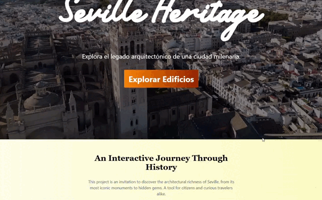

# 🏛️ Seville Heritage

**Seville Heritage** is a **Single Page Application (SPA)** that allows users to explore Seville's architectural and historical heritage through an intuitive and interactive interface.

Built with **Angular**, the application follows a modular, component-based architecture and retrieves data from a **REST API** to deliver a fast, responsive, and dynamic user experience.

## 🌐 Live Demo

  

👉 **Explore the application:**  
https://gonzalosr17.github.io/Api-Seville-Heritage/

## ✨ Key Features

- 🗺️ Interactive maps powered by **Leaflet.js** and **OpenStreetMap**
- 🔎 Advanced filtering by architect, district, category, and construction year
- 📄 Detailed monument information displayed in responsive modal dialogs
- ⚡ Reactive data management using **RxJS**
- 📱 Fully responsive interface built with **Tailwind CSS** and **PrimeNG**
- 🧩 Modular Angular architecture following best practices

## 🚀 Tech Stack

| Category                   | Technologies                                                                            |
| -------------------------- | --------------------------------------------------------------------------------------- |
| 🎨 **Frontend**            | Angular 14+, TypeScript, HTML5                                                          |
| 💅 **Styling & UI**        | CSS3, Tailwind CSS, PrimeNG, Flexbox, CSS Grid                                          |
| 🌐 **API Communication**   | Angular HttpClient, REST API, JSON                                                      |
| ⚡ **Reactive Programming** | RxJS, Observables                                                                       |
| 🗺️ **Maps**               | Leaflet.js, OpenStreetMap                                                               |
| 🏛️ **Architecture**       | Single Page Application (SPA), Client–Server Architecture, Component-Based Architecture |
| 🔍 **Features**            | Dynamic filtering, advanced search, interactive maps, modal dialogs                     |
| 📱 **Responsive Design**   | Mobile-First Design, Tailwind CSS, Flexbox, CSS Grid                                    |
| 🌱 **Version Control**     | Git, GitHub                                                                             |
